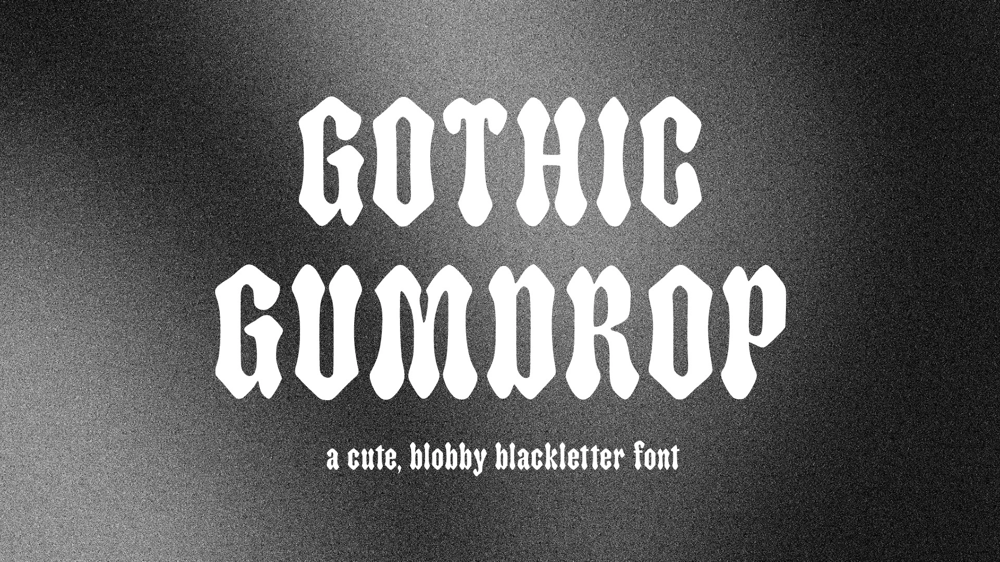
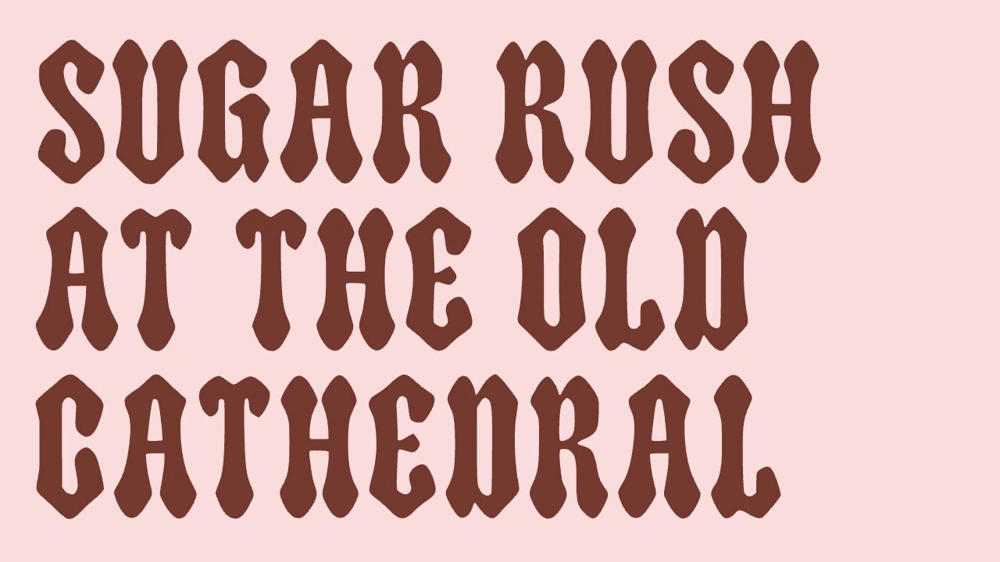
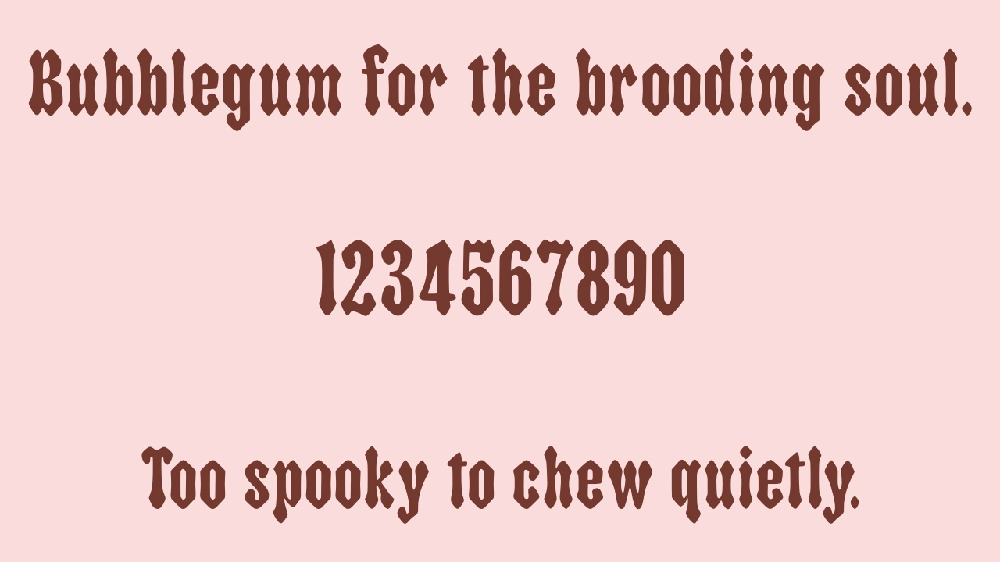
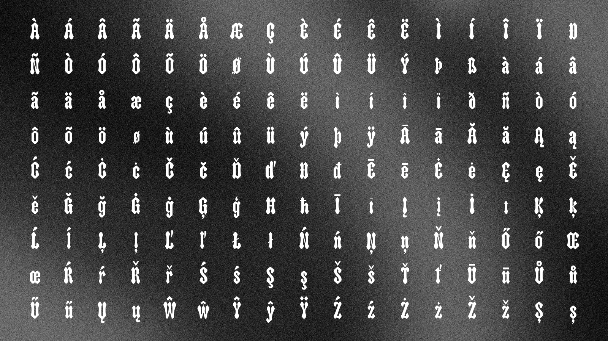
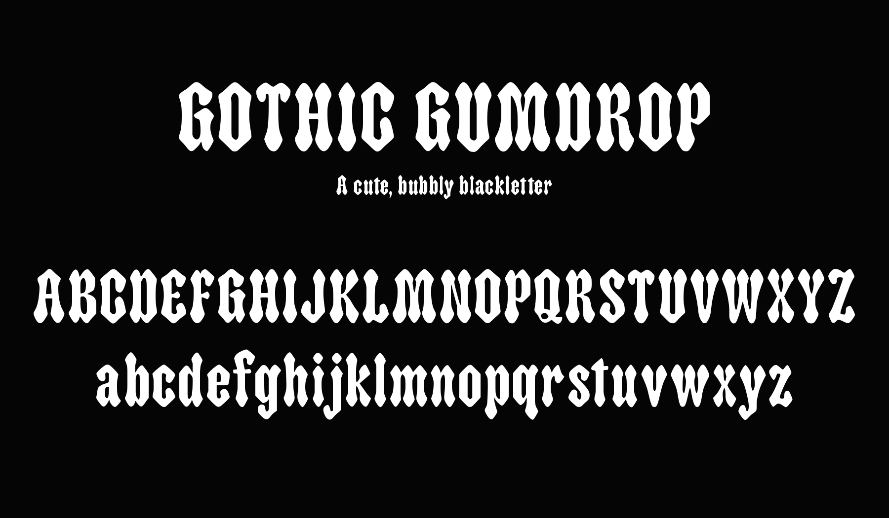

# Gothic Gumdrop

Gothic Gumdrop is a cute, bubbly blackletter font. This came out of a project to explore and combine unique or unrelated styles. There are many blackletter fonts, and many cute bubble fonts, but none that really combined the two into a single typeface. Great for posters, display use, or metal bands that have a softer side.









This font was created with the help of the Mixfont [AI font generation](https://www.mixfont.com/font-generator) model.

## Building

Install the Python dependencies:

```sh
python3 -m venv venv
source venv/bin/activate
pip install -r requirements.txt
```

Build the TTF from source:

```sh
bash build.sh
```

The built font is written to `fonts/ttf/GothicGumdrop-Regular.ttf`.

## Quality Checks

Run FontBakery locally:

```sh
fontbakery check-universal fonts/ttf/GothicGumdrop-Regular.ttf
fontbakery check-googlefonts fonts/ttf/GothicGumdrop-Regular.ttf
```

## License

Gothic Gumdrop is licensed under the SIL Open Font License, Version 1.1. See `OFL.txt` for details.

## Character Set


