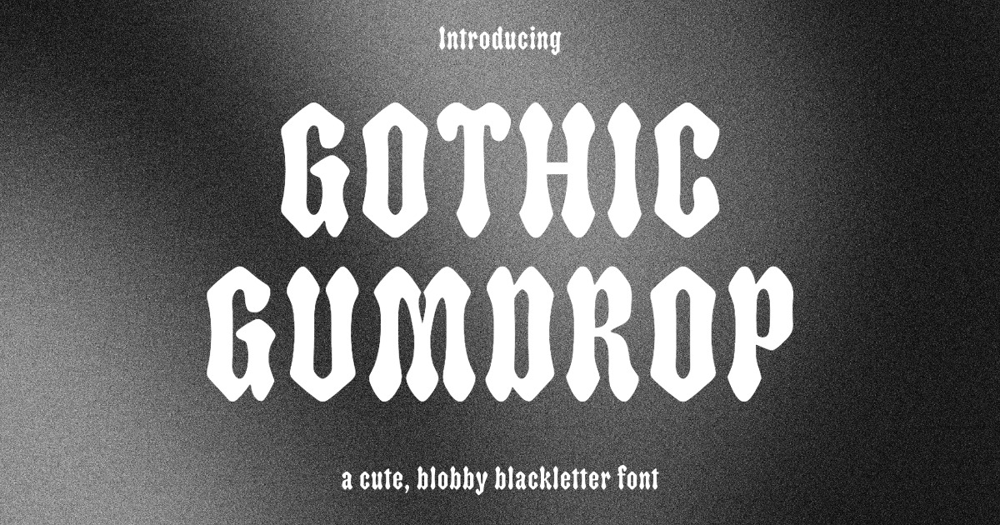
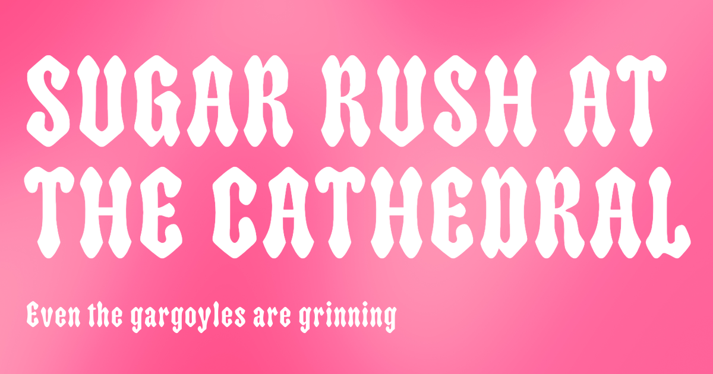
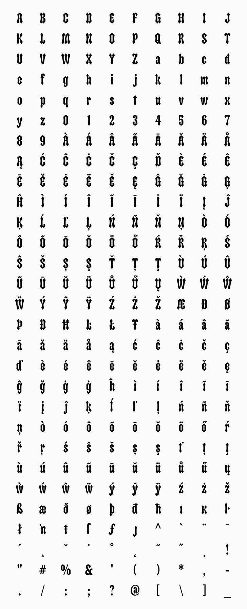

# Gothic Gumdrop

Gothic Gumdrop is a cute, bubbly blackletter font. Its bold blend of traditional blackletter with modern charm makes it perfect for headlines, display use, or even metal band posters that need a softer side. Gothic Gumdrop preserves the thickness and ornateness of a traditional blackletter while also expressing an endearing, mellow side in each letter. It brings a new, playful spirit to a centuries-old lettering tradition.

The design and initial glyphset of Gothic Gumdrop were initially created by the artificial intelligence model developed by Mixfont and its founder, Eric Lu. The original style, letters, glyphs, and shapes were all generated from a single prompt: "a cute, bubbly blackletter font". For the latest release, Mixfont has partnered with type designer Alex Kaczun of Type Innovations to improve the initially AI-generated design into a fully professional, production-ready typeface. Through this close collaboration, Alex improved upon the initial design, ensuring that letterforms, alignments, kerning, and other details are all ready for professional use. 

We are proud to release Gothic Gumdrop as the world's first AI-generated typeface. This is a major milestone that we believe is just the beginning of an evolving relationship between artificial intelligence and traditional type design.

## Font and source

- [Regular TTF](fonts/ttf/GothicGumdrop-Regular.ttf): version 1.100, 400 glyphs,
  386 encoded codepoints; font family name **Gothic Gumdrop**.
- [FontLab source](sources/GothicGumDrop-Regular.vfc): preserved exactly as supplied.
- [Source and build status](sources/README.md).

## License and credits

The font is released under the [SIL Open Font License 1.1](OFL.txt).
Copyright holders are Mixfont LLC and Type Innovations Inc.; see
[AUTHORS.txt](AUTHORS.txt) and [CONTRIBUTORS.txt](CONTRIBUTORS.txt).
[TRADEMARKS.md](TRADEMARKS.md) grants permissive use of the name, explicitly
including Google Fonts.

